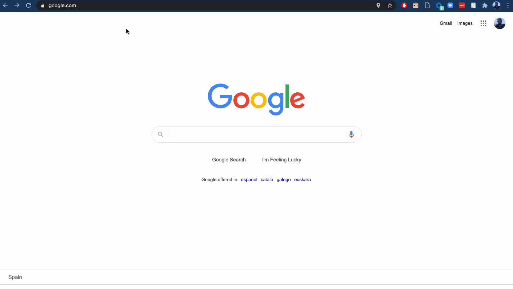

# Functional tests for Observability projects

## Smoke Tests

We want to make sure that the different test suites in this project are covering the main use cases for their core functionalities. So for that reason we are adding [smoke tests](http://softwaretestingfundamentals.com/smoke-testing/) to verify that each test suite meets the specifications described here with certain grade of satisfaction.

>Smoke Testing, also known as “Build Verification Testing”, is a type of software testing that comprises of a non-exhaustive set of tests that aim at ensuring that the most important functions work. The result of this testing is used to decide if a build is stable enough to proceed with further testing.

## Tooling

As we want to run _functional tests_, we need a manner to describe the functionality to implement in a _functional manner_, which means using plain English to specify how our software behaves. The most accepted manner to achieve this specification in the software industry, using a high level approach that anybody in the team could understand and backed by a testing framework, is [`Cucumber`](https://cucumber.io). So we will use `Cucumber` to set the behaviour (use cases) of our software.

Then we need a manner to connect that plain English feature specification with code. Fortunately, `Cucumber` has a wide number of implementations (Java, Ruby, NodeJS, Go...), so we can choose one of them to implement our tests.

We are going to use Golang for writing the functional tests, so we would need the Golang implementation for `Cucumber`. That implementation is [`Godog`](https://github.com/cucumber/godog), which is the glue between the specs files and the Go code. Godog is a wrapper over the traditional `go test` command, adding the ability to run the functional steps defined in the feature files.

The implementation of these smoke tests has been done with [Godog](https://github.com/cucumber/godog) + [Cucumber](https://cucumber.io/).

### Cucumber: BDD at its core

The specification of these smoke tests has been done using the `BDD` (Behaviour-Driven Development) principles, where:

>BDD aims to narrow the communication gaps between team members, foster better understanding of the customer and promote continuous communication with real world examples.

From Cucumber's website:

>Cucumber is a tool that supports Behaviour-Driven Development(BDD), and it reads executable specifications written in plain text and validates that the software does what those specifications say. The specifications consists of multiple examples, or scenarios.

The way we are going to specify our software is using [`Gherkin`](https://cucumber.io/docs/gherkin/reference/).

>Gherkin uses a set of special keywords to give structure and meaning to executable specifications. Each keyword is translated to many spoken languages. Most lines in a Gherkin document start with one of the keywords.

The key part here is **executable specifications**: we will be able to automate the verification of the specifications and potentially get a coverage of these specs.

### Godog: Cucumber for Golang

From Godog's website:

>Package godog is the official Cucumber BDD framework for Golang, it merges specification and test documentation into one cohesive whole.

For this test framework, we have chosen Godog over any other test framework because the team is already using Golang, so it seems reasonable to choose it.

## Test Specification

All the Gherkin (Cucumber) specifications are written in `.feature` files.

A good example could be [this one](./_suites/metricbeat/features/metricbeat.feature).

## Test Implementation

We are using Godog + Cucumber to implement the tests, where we create connections to the `Given`, `When`, `Then`, `And`, etc. in a well-known file structure.

As an example, the Golang implementation of the `./_suites/metricbeat/features/metricbeat.feature` is located under the [metricbeat_test.go](./_suites/metricbeat/metricbeat_test.go) file.

Each module will define its own file for specificacions, adding specific feature context functions that will allow filtering the execution, if needed. 

## Technology stack

### Docker containers
The services supported by some of the test suites in this framework will be started in the form of Docker containers. To manage the life cycle of those containers in test time we are going to use [`Testcontainers`](https://testcontainers.org), a set of libraries to simplify the usage of the Docker client, attaching container life cycles to the tests, so whenever the tests finish, the containers will stop in consequence.

### Runtime dependencies
In many cases, we want to store the metrics in Elasticsearch, so at some point we must start up an Elasticsearch instance. Besides that, we want to query the Elasticsearch to perform assertions on the metrics, such as there are no errors, or the field `f.foo` takes the value `bar`. For that reason we need an Elasticsearch in a well-known location. Here it appears the usage of the [Observability Provisioner CLI tool](../cli/README.md), which is a CLI writen in Go which exposes an API to query the specific runtime resources needed to run the tests. In our case, Metricbeat, we need just an Elasticsearch, but a Kibana could be needed in the case of verifying the dashboards are correct.

### Feature files
We will create use cases for the module in a separate `.feature` file, ideally named after the name of the feature to test (i.e. _apache.feature_), and located under the `features` directory of each test suite. This feature file is a Cucumber requirement, that will be parsed by the Godog test runner and matched against the Golang code implementing the tests.

The anatomy of a feature file is:

- **@tag_name**: A `@` character indicates a tag. And tags are used to filter the test execution. Tags could be placed on Features (applying the entire file), or on Scenarios (applying just to them). At this moment we are tagging each feature file with a tag using module's name, so that we can instrument the test runner to just run one.
- **Feature: Blah, blah**: Description in plain English of the group of uses cases (scenarios) in this feature file. The feature file should contain just one.
- **Scenario**: the name in plain English of a specific use case.
- **Scenario Outline**: exactly the same as above, but we are are telling Cucumber that this use case has a matrix, so it has to iterate through the **Examples** table, interpolating those values into the placeholders in the scenario.
- **Given, Then, When, And, But keywords**: Their meaning is extremely important in order to understand the use case they are part of, although they have no real impact in how we use them. If we use `doble quotes` around one or more words, that will tell Cucumber the presence of a fixed variable, with value the word/s among the double quotes. These variables will be the input parameters of the implementation functions in Go code. If we use `angles` around one or more words, that will tell Cucumber the presence of a dynamic variable, taken from the examples table.
    - **Given**: It must tell an ocational reader what state must be in place for the use case to be valid.
    - **When**: It must tell an ocational reader what action or actions trigger the use case.
    - **Then**: It must tell an ocational reader what outcome has been generated after the use case happens.
    - **And**: Used within any of the above clauses, it must tell an ocational reader a secondary preparation (Given), trigger (When), or output (Then) that must be present.
    - **But**: Used within any of the above clauses, it must tell an ocational reader a secondary preparation (Given), trigger (When), or output (Then) that must not be present.
- **Examples:**: this `markdown table` will represent the elements to interpolate in the existing dynamic variables in the use case, being each column header the name of the different variables in the table. Besides that, each row will result in a test execution.

### Configuration files
It's possible that there will exist configuration YAML files in the test suire. We recommend locating them under the `configurations` folder in the suite directory. The name of the file will represent the feature to be tested (i.e. `apache.yml`). In this file we will add those configurations that are exclusive to the feature to be tests.

## Generating documentation about the specifications
If you want to generate a website for the feature files, please run this command:

```shell
$ make build-docs
```

It will generate the website under the `./docs` directory (which is ignored in Git). You'll be able to navigate through the feature files and scenarios in a website.

## Debugging the tests

### VSCode
When using VSCode as editor, it's possible to debug the project using the existing VSCode configurations for debug.

In order to debug the `godog` tests, 1) you must have the `runner_test.go` file opened as the current file in the IDE, 2) Use the Run/Debug module of VSCode, and 3) select the `Godog Tests` debug configuration to be executed.


## Regression testing
We have built the project and the CI job in a manner that it is possible to override different parameters about projects versions, so that we can set i.e. the version of the Elastic Stack to be used, or the version of the Elastic Agent. There also exist maintenance branches where we set the specific versions used for the tests:

- **7.10.x**: will use `7.10.x` alias for the Elastic Stack, the Agent and Metricbeat
- **7.11.x**: will use `7.11.x` alias for the Elastic Stack, the Agent and Metricbeat
- **7.x**: will use `7.x` alias for the Elastic Stack, the Agent and Metricbeat
- **master**: will use `8.0.0-SNAPSHOT` for the Elastic Stack, the Agent and Metricbeat, representing the current development version of the different products under test.

With that in mind, the project supports setting these versions in environment variables, overriding the pre-branch default ones.

### Overriding Product versions
We are going to enumerate the variables that will affect the product versions used in the tests, per test suite:

>It's important to notice that the 7.9.x branch in **Fleet** test suite uses different source code for the communications with Kibana Fleet plugin, as API endpoints changed from 7.9 to 7.10, so there could be some combinations that are broken. See https://github.com/elastic/e2e-testing/pull/348 for further reference about these breaking changes.

> Related to this compatibility matrix too, it's also remarkable that Kibana **Fleet** plugin should not allow to enroll an agent with a version higher than kibana (See https://github.com/elastic/kibana/blob/fed9a4fddcc0087ee9eca6582a2a84e001890f08/x-pack/test/fleet_api_integration/apis/agents/enroll.ts#L99).

#### Fleet
- `BEAT_VERSION`. Set this environment variable to the proper version of the Elastic Agent to be used in the current execution. Default: See https://github.com/elastic/e2e-testing/blob/0446248bae1ff604219735998841a21a7576bfdd/.ci/Jenkinsfile#L36
- `ELASTIC_AGENT_DOWNLOAD_URL`. Set this environment variable if you know the bucket URL for an Elastic Agent artifact generated by the CI, i.e. for a pull request. It will take precedence over the `BEAT_VERSION` variable. Default empty: See https://github.com/elastic/e2e-testing/blob/0446248bae1ff604219735998841a21a7576bfdd/.ci/Jenkinsfile#L35
- `ELASTIC_AGENT_STALE_VERSION`. Set this environment variable to the proper version of the Elastic Agent to be used in the upgrade tests, representing the version to be upgraded. Default: See https://github.com/elastic/e2e-testing/blob/b8d0cb09d575f90f447fe3331b6df0a185c01c89/.ci/Jenkinsfile#L38

#### Helm charts
- `HELM_CHART_VERSION`. Set this environment variable to the proper version of the Helm charts to be used in the current execution. Default: See https://github.com/elastic/e2e-testing/blob/0446248bae1ff604219735998841a21a7576bfdd/.ci/Jenkinsfile#L43
- `HELM_VERSION`. Set this environment variable to the proper version of Helm to be used in the current execution. Default: See https://github.com/elastic/e2e-testing/blob/0446248bae1ff604219735998841a21a7576bfdd/.ci/Jenkinsfile#L44
- `HELM_KIND_VERSION`. Set this environment variable to the proper version of Kind (Kubernetes in Docker) to be used in the current execution. Default: See https://github.com/elastic/e2e-testing/blob/0446248bae1ff604219735998841a21a7576bfdd/.ci/Jenkinsfile#L45
- `HELM_KUBERNETES_VERSION`. Set this environment variable to the proper version of Kubernetes to be used in the current execution. Default: See https://github.com/elastic/e2e-testing/blob/0446248bae1ff604219735998841a21a7576bfdd/.ci/Jenkinsfile#L46

#### Metricbeat
- `BEAT_VERSION`. Set this environment variable to the proper version of the Metricbeat to be used in the current execution. Default: See https://github.com/elastic/e2e-testing/blob/0446248bae1ff604219735998841a21a7576bfdd/.ci/Jenkinsfile#L42

### Environment variables affecting the build
The following environment variables affect how the tests are run in both the CI and a local machine.

- `ELASTIC_APM_ACTIVE`: Set this environment variable to `true` if you want to send instrumentation data to our CI clusters. When the tests are run in our CI, this variable will always be enabled. Default value: `false`.

>"ELASTIC_APM_ACTIVE" only affects Helm and Metricbeat test suites.

- `ELASTIC_APM_ENVIRONMENT`: Set this environment variable to `ci` to send APM data to Elastic Cloud. Otherwise, the framework will spin up local APM Server and Kibana instances. For the CI, it will read credentials from Vault. Default value: `local`.
- `SKIP_SCENARIOS`: Set this environment variable to `false` if it's needed to include the scenarios annotated as `@skip` in the current test execution. Default value: `true`.
- `BEATS_LOCAL_PATH`: Set this environment variable to the base path to your local clone of Beats if it's needed to use the binary snapshots produced by your local build instead of the official releases. The snapshots will be fetched from the `${BEATS_LOCAL_PATH}/${THE_BEAT}/build/distributions` local directory. This variable is intended to be used by Beats developers, when testing locally the artifacts generated its own build. Default: empty.
- `BEATS_USE_CI_SNAPSHOTS`: Set this environment variable to `true` if it's needed to use the binary snapshots produced by Beats CI instead of the official releases. The snapshots will be downloaded from a bucket in Google Cloud Storage. This variable is used by the Beats repository, when testing the artifacts generated by the packaging job. Default: `false`.
- `LOG_LEVEL`: Set this environment variable to `TRACE`, `DEBUG`, `INFO`, `WARN`, `ERROR` or `FATAL` to set the log level in the project. Default: `INFO`.
- `DEVELOPER_MODE`: Set this environment variable to `true` to activate developer mode, which means not destroying the services provisioned by the test framework. Default: `false`.
- `STACK_VERSION`. Set this environment variable to the proper version of the Elastic Stack (Elasticsearch and Kibana) to be used in the current execution. The default value depens on the branch you are targeting your work.
    - **master (Fleet):** https://github.com/elastic/e2e-testing/blob/0446248bae1ff604219735998841a21a7576bfdd/e2e/_suites/fleet/ingest-manager_test.go#L39
    - **master (Integrations):** https://github.com/elastic/e2e-testing/blob/0446248bae1ff604219735998841a21a7576bfdd/e2e/_suites/metricbeat/metricbeat_test.go#L30
- `TIMEOUT_FACTOR`: Set this environment variable to an integer number, which represents the factor to be used while waiting for resources within the tests. I.e. waiting for Kibana needs around 30 seconds. Instead of hardcoding 30 seconds, or 3 minutes, in the code, we use a backoff strategy to wait until an amount of time, specific per situation, multiplying it by the timeout factor. With that in mind, we are able to set a higher factor on CI without changing the code, and the developer is able to locally set specific conditions when running the tests on slower machines. Default: `3`.
### Running regressions locally
This example will run the Fleet tests for the 8.0.0-SNAPSHOT stack with the released 7.10.1 version of the agent.

```shell
# Use the proper branch
git checkout master
# Run the tests for a specific branch
SUITE="fleet" \
    TIMEOUT_FACTOR=3 LOG_LEVEL=TRACE \
    TAGS="fleet_mode" \
    BEAT_VERSION="7.10.1" \
    make -C e2e functional-test
```

When running regression testing locally, please make sure you clean up tool's workspace among runs.

```shell
# It will remove $HOME/.op/compose files
make clean-workspace
```

If you want to refresh the Docker images used by the tests:

```shell
# It will remove and pull the images used in the current branch. Breathe, it will take time.
make clean-docker
```

>`make clean` will do both clean-up operations

### Running regressions on CI
Because we are able to parameterize a CI job, it's possible to run regression testing with different versions of the stack and the products under test. To achieve it we must navigate to Jenkins and run the tests with different combinations for each product.

To do so:

1. Navigate to Jenkins: https://beats-ci.elastic.co/job/e2e-tests/job/e2e-testing-mbp/
1. Login as a user
1. Select the base branch for the test code: 7.9.x, 7.10.x, 7.x or master.
1. In the left menu, click on `Buid with Parameters`.
1. In the input parameters form, set the stack version (for Fleet or Metricbeat) using the specific variables for the test suite.
1. (Optional) Set the product version (Fleet, Helm charts or Metricbeat) using the specific variables for the test suite if you want to consume a different artifact.
1. Click the `Build` button at the bottom of the parameters form.

Here you have a video reproducing the same steps:


### Running tests for a Beats pull request
Because we trigger the E2E tests for each Beats PR that is packaged, it's possible to manually trigger it using CI user interface. To achieve it we must navigate to Jenkins and run the tests in the specific branch the original Beats PR is targeting.

>For further information about packaging Beats, please read [Beat's CI docs](https://github.com/elastic/beats/blob/1de27eed058dd074b58c71094c7678b3536251cb/README.md#ci).

To do so:

1. Navigate to Jenkins: https://beats-ci.elastic.co/job/e2e-tests/job/e2e-testing-mbp/
1. Login as a user
1. Select the base branch for the test code: 7.10.x, 7.11.x, 7.x or master.
1. In the left menu, click on `Buid with Parameters`.
1. In the input parameters form, keep the Beat version (for Fleet and Metricbeat) as is, to use each branch's default version.
1. In the input parameters form, keep the stack version (for Fleet and Metricbeat) as is, to use each branch's default version.
1. In the input parameters form, set the `GITHUB_CHECK_NAME` to `E2E Tests`. This value will appear as the label for the Github check for the E2E tests.
1. In the input parameters form, set the `GITHUB_CHECK_REPO` to `beats`.
1. In the input parameters form, set the `GITHUB_CHECK_SHA1` to the `SHA1` of the last commit in your pull request. This value will allow us to modify the mergeable status of that commit with the Github check.
1. Click the `Build` button at the bottom of the parameters form.

## Noticing the test framework

To generate the notice files for this project:

1. Execute `make notice` to generate NOTICE.txt file.
