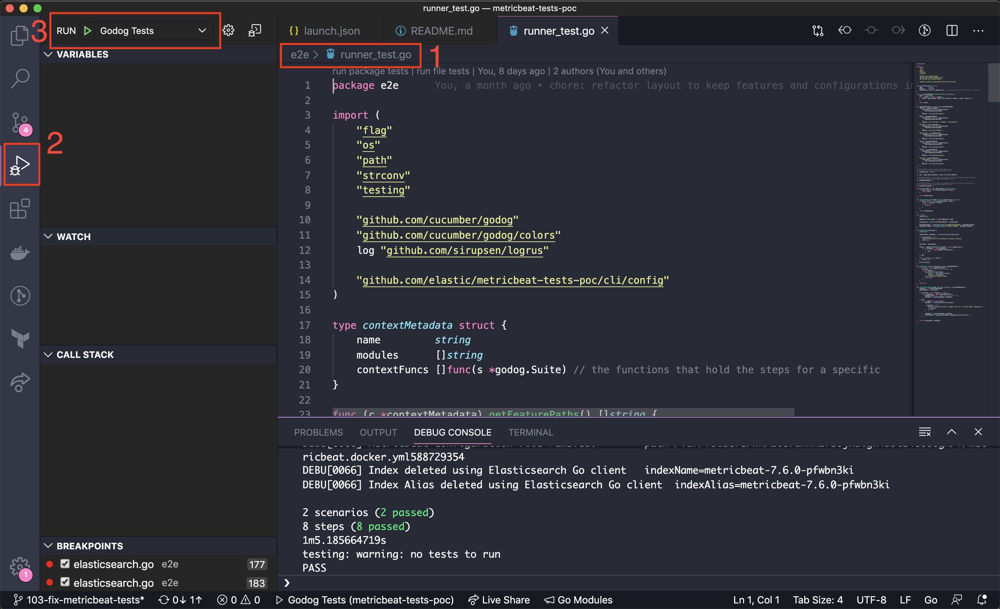

# Functional tests for Observability projects

## Smoke Tests

We want to make sure that the different test suites in this project are covering the main use cases for their core functionalities. So for that reason we are adding [smoke tests](http://softwaretestingfundamentals.com/smoke-testing/) to verify that each test suite meets the specifications described here with certain grade of satisfaction.

>Smoke Testing, also known as “Build Verification Testing”, is a type of software testing that comprises of a non-exhaustive set of tests that aim at ensuring that the most important functions work. The result of this testing is used to decide if a build is stable enough to proceed with further testing.

## Tooling

As we want to run _functional tests_, we need a manner to describe the functionality to implement in a _functional manner_, which means using plain English to specify how our software behaves. The most accepted manner to achieve this specification in the software industry, using a high level approach that anybody in the team could understand and backed by a testing framework, is [`Cucumber`](https://cucumber.io). So we will use `Cucumber` to set the behaviour (use cases) of our software.

Then we need a manner to connect that plain English feature specification with code. Fortunately, `Cucumber` has a wide number of implementations (Java, Ruby, NodeJS, Go...), so we can choose one of them to implement our tests.

We are going to use Golang for writing the functional tests, so we would need the Golang implementation for `Cucumber`. That implementation is [`Godog`](https://github.com/cucumber/godog), which is the glue between the specs files and the Go code. Godog is a wrapper over the traditional `go test` command, adding the ability to run the functional steps defined in the feature files.

The implementation of these smoke tests has been done with [Godog](https://github.com/cucumber/godog) + [Cucumber](https://cucumber.io/).

### Cucumber: BDD at its core

The specification of these smoke tests has been done using the `BDD` (Behaviour-Driven Development) principles, where:

>BDD aims to narrow the communication gaps between team members, foster better understanding of the customer and promote continuous communication with real world examples.

From Cucumber's website:

>Cucumber is a tool that supports Behaviour-Driven Development(BDD), and it reads executable specifications written in plain text and validates that the software does what those specifications say. The specifications consists of multiple examples, or scenarios.

The way we are going to specify our software is using [`Gherkin`](https://cucumber.io/docs/gherkin/reference/).

>Gherkin uses a set of special keywords to give structure and meaning to executable specifications. Each keyword is translated to many spoken languages. Most lines in a Gherkin document start with one of the keywords.

The key part here is **executable specifications**: we will be able to automate the verification of the spefications anf potentially get a coverage of these specs.

### Godog: Cucumber for Golang

From Godog's website:

>Package godog is the official Cucumber BDD framework for Golang, it merges specification and test documentation into one cohesive whole.

For this test framework, we have chosen Godog over any other test framework because the team is already using Golang, so it seems reasonable to choose it.

## Test Specification

All the Gherkin (Cucumber) specifications are written in `.feature` files.

A good example could be [this one](./_suites/metricbeat/features/mysql.feature).

## Test Implementation

We are using Godog + Cucumber to implement the tests, where we create connections to the `Given`, `When`, `Then`, `And`, etc. in a well-known file structure.

As an example, the Golang implementation of the `./_suites/metricbeat/features/mysql.feature` is located under the [metricbeat_test.go](./_suites/metricbeat/metricbeat_test.go) file.

Each module will define its own file for specificacions, adding specific feature context functions that will allow filtering the execution, if needed. 

## Technology stack

### Docker containers
The services supported by some of the test suites in this framework will be started in the form of Docker containers. To manage the life cycle of those containers in test time we are going to use [`Testcontainers`](https://testcontainers.org), a set of libraries to simplify the usage of the Docker client, attaching container life cycles to the tests, so whenever the tests finish, the containers will stop in consequence.

### Runtime dependencies
In many cases, we want to store the metrics in Elasticsearch, so at some point we must start up an Elasticsearch instance. Besides that, we want to query the Elasticsearch to perform assertions on the metrics, such as there are no errors, or the field `f.foo` takes the value `bar`. For that reason we need an Elasticsearch in a well-known location. Here it appears the usage of the [Observability Provisioner CLI tool](../cli/README.md), which is a CLI writen in Go which exposes an API to query the specific runtime resources needed to run the tests. In our case, Metricbeat, we need just an Elasticsearch, but a Kibana could be needed in the case of verifying the dashboards are correct.

### Feature files
We will create use cases for the module in a separate `.feature` file, ideally named after the name of the feature to test (i.e. _apache.feature_), and located under the `features` directory of each test suite. This feature file is a Cucumber requirement, that will be parsed by the Godog test runner and matched against the Golang code implementing the tests.

The anatomy of a feature file is:

- **@tag_name**: A `@` character indicates a tag. And tags are used to filter the test execution. Tags could be placed on Features (applying the entire file), or on Scenarios (applying just to them). At this moment we are tagging each feature file with a tag using module's name, so that we can instrument the test runner to just run one.
- **Feature: Blah, blah**: Description in plain English of the group of uses cases (scenarios) in this feature file. The feature file should contain just one.
- **Scenario**: the name in plain English of a specific use case.
- **Scenario Outline**: exactly the same as above, but we are are telling Cucumber that this use case has a matrix, so it has to iterate through the **Examples** table, interpolating those values into the placeholders in the scenario.
- **Given, Then, When, And, But keywords**: Their meaning is extremely important in order to understand the use case they are part of, although they have no real impact in how we use them. If we use `doble quotes` around one or more words, that will tell Cucumber the presence of a fixed variable, with value the word/s among the double quotes. These variables will be the input parameters of the implementation functions in Go code. If we use `angles` around one or more words, that will tell Cucumber the presence of a dynamic variable, taken from the examples table.
    - **Given**: It must tell an ocational reader what state must be in place for the use case to be valid.
    - **When**: It must tell an ocational reader what action or actions trigger the use case.
    - **Then**: It must tell an ocational reader what outcome has been generated after the use case happens.
    - **And**: Used within any of the above clauses, it must tell an ocational reader a secondary preparation (Given), trigger (When), or output (Then) that must be present.
    - **But**: Used within any of the above clauses, it must tell an ocational reader a secondary preparation (Given), trigger (When), or output (Then) that must not be present.
- **Examples:**: this `markdown table` will represent the elements to interpolate in the existing dynamic variables in the use case, being each column header the name of the different variables in the table. Besides that, each row will result in a test execution.

### Configuration files
It's possible that there will exist configuration YAML files in the test suire. We recommend locating them under the `configurations` folder in the suite directory. The name of the file will represent the feature to be tested (i.e. `apache.yml`). In this file we will add those configurations that are exclusive to the feature to be tests.

## Debugging the tests

### VSCode
When using VSCode as editor, it's possible to debug the project using the existing VSCode configurations for debug.

In order to debug the `godog` tests, 1) you must have the `runner_test.go` file opened as the current file in the IDE, 2) Use the Run/Debug module of VSCode, and 3) select the `Godog Tests` debug configuration to be executed.

## Noticing the test framework

Because we are using a project layout which consumes another directory from the same project (the CLI), and the test project uses its own `go.mod` file, totally decoupled from the CLI one, we are forced to do a workaround to generate the notice files for this project:

1. In the go.mod file, remove the `replace` entry, which replaces the upstream dependency with the local one.
1. Execute `make notice` to generate NOTICE.txt file.
1. Do not forget to return back the `go.mod` to its original state without commiting the change.

For more information about this workaround please read https://github.com/elastic/go-licence-detector/issues/11.
